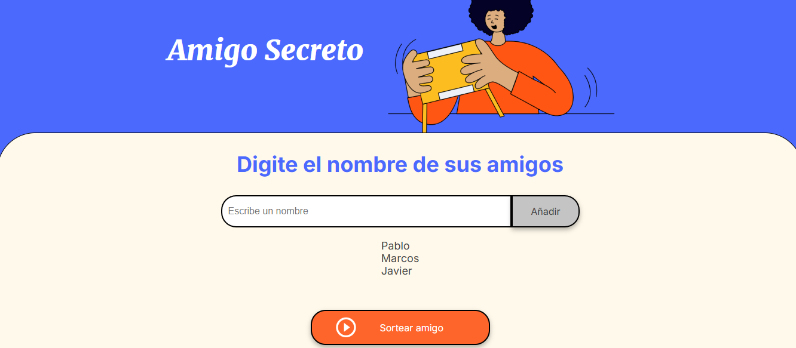

# Proyecto Amigo Secreto

## Índice

1. [Descripción del Proyecto](#descripción-del-proyecto)
2. [Estado del Proyecto](#estado-del-proyecto)
3. [Demostración de Funciones y Aplicaciones](#demostración-de-funciones-y-aplicaciones)
4. [Tecnologías Utilizadas](#tecnologías-utilizadas)
5. [Persona Desarrolladora del Proyecto](#persona-desarrolladora-del-proyecto)
6. [Licencia](#licencia)

## Descripción del Proyecto

Este proyecto es una aplicación web interactiva para realizar un sorteo de amigos entre un grupo de personas. Los usuarios pueden agregar sus amigos a una lista, y el sistema selecciona aleatoriamente un amigo secreto de la lista para cada persona.

Es ideal para eventos, celebraciones o grupos de amigos que deseen organizar un juego de amigo secreto de manera fácil y rápida.

## Estado del Proyecto

## Demostración de Funciones y Aplicaciones

A continuación, se muestran algunas capturas de pantalla y una breve demostración del proyecto en acción:

- **Agregar amigos**: El usuario puede añadir los nombres de sus amigos a la lista.

- **Sortear amigo secreto**: El sistema selecciona aleatoriamente un nombre de la lista de amigos.

## 🚀 Tecnologías Utilizadas

## Persona Desarrolladora del Proyecto
Jhon Cuji - Desarrollador principal y creador del proyecto.

## Licencia

Este proyecto está bajo la licencia MIT.
